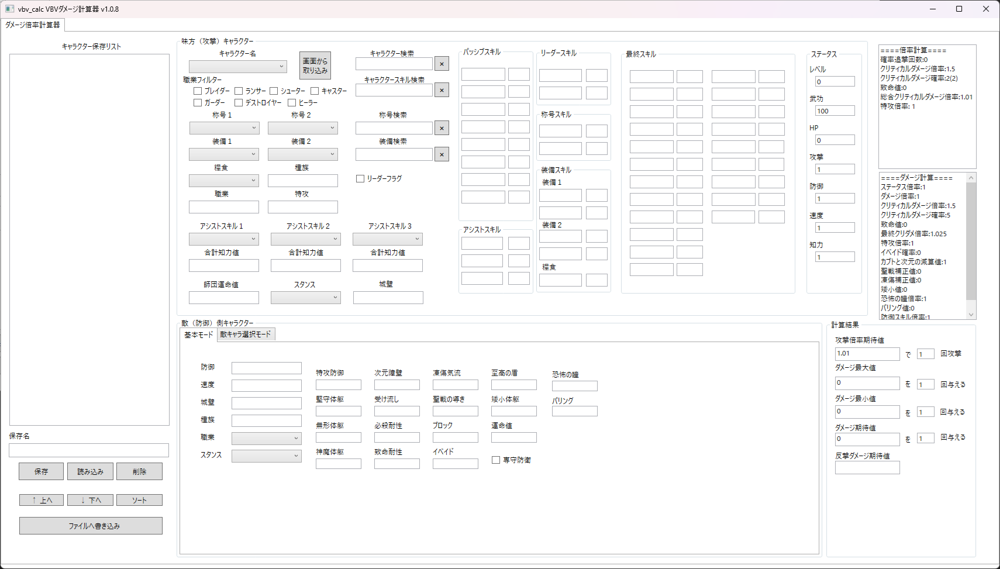
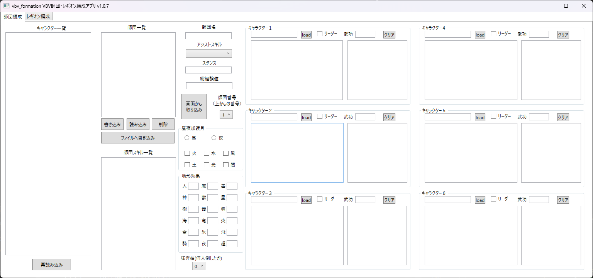

# はじめに
vbv_calcは、dualtail様のVenus Blood VALKYRIEのダメージを計算するものです。
非公式であり多くの間違いを含んでいるので、このソフトウェアについての内容の問い合わせをdualtail様にするのは絶対にやめてください。  
以下ではvbv_calcの内部的な仕様や注意事、使い方などいろいろ書いています。適当に読み飛ばしちゃってもVBVの画面に近くしたつもりなのでフィーリングで使えるはずです。

# ライセンスと使用しているデータについて
https://wikiwiki.jp/vbv-jp2/ のデータを使用させていただいています。感謝です。
ライセンスに書いてありますが、これらのデータは二次利用の規約があり、本ソフトウェアのライセンスと異なるためご確認ください。
なお、こちらのJSONが古かったり色々あるので、wikiのほうにフィードバックする際はwikiのデータをよくご確認の上フィードバックをお願いします。
本ソフトウェア自体はMITライセンスですが、細かい情報についてはLicense.txtを参照してください。

# 計算結果などについて
本ソフトウェアの計算結果について、正しいかどうかは保証しませんしわかりません。dualtail様に問い合わせをするなどもしないでください。

# 依存関係と動作環境
このソフトウェアではNewtonsoft.Jsonのライブラリを使用しています。
また、C#と.NETバージョンは以下です。.NET8.0のランタイムが必要ですので、なければ入れてください。
- .NET 8（ターゲットフレームワーク）
- C# 12.0（言語バージョン）

また、本ソフトウェアはWindows11 64bitでしか動作確認していません。LinuxやMacOSで動くかはわかりません。

# ダメージ倍率計算アプリ(vbv_calc.exe)
## 画面と使い方について

上側の画面がプレイヤー(攻撃)側のキャラクターの設定画面です。キャラクターを選び、称号、装備、糧食、リーダーか否かを選ぶと大体の倍率計算ができます。右下にある「攻撃倍率期待値」というのがそれです。  
キャラクター、称号、装備(糧食含む)のそれぞれ検索ボックスに文字を入れると部分一致で検索できます。隣の×ボタンを押すと文字列が消えます。

次に下側の左、専守防衛のチェックボックスまでが敵(防御)ステータスの画面です。こちらはキャラクターを選べませんが、防御、速度、城壁(敵の)、種族を設定し、防御にかかわるスキル値を手動で入れるとダメージを計算できます。
値を入れるたびに右下のダメージ最大値・最小値・期待値が連動して動きます。これはダメージといってもゲーム中でのダメージを模擬したものです。  

師団運命値については、師団の運命の輪の値を想定しています。活性などは最悪ステータスを直接変えちゃえばいいのですが、運命の輪は影響が大きい上に変えられないので、これで変更できます。
仕様としては最終スキルに運命改変の形で反映されます。もちろん自分で運命系を持っていれば加算されます。

右上にあるのはある種デバッグメッセージめいたものです。各スキルやクリティカルの倍率などを出しています。各スキルがどれぐらいの倍率かの確認が主ですが、計算が間違ってそうならまずここを確かめるといいかもしれません。  

左側のリストでは設定したキャラクターデータを保存・読み込みできます。キャラクター名、装備、称号、糧食、リーダーフラグ、アシストスキルを保存します。セレクトしている状態で削除ボタンを押すと削除できます。

ファイルに保存は、json/saved.jsonというJSONファイルに保存されます。ファイルから読み込みでこのJSONファイルを読み込みリストを再構築します。バックアップなどは手動で別に保存してください。
ファイルから読み込みボタンを押すと有無を言わさずリストを再構築しますので、保存していないデータは消えます。注意してください。
起動時にはファイルが存在すれば自動で読み込みます。終了時に保存するという気の利いたことはしてくれないので、定期的に保存ボタンを押してください。

## 仕様
### キャラクターの称号について
仕様として、キャラクターの称号は1称号1スキルとしているため、称号は2つ設定をお願いします。ありえない組み合わせもできますが…
2つ設定しないとスキルがちゃんと付与されませんので、気を付けてください。
形態素解析のライブラリを使って適当に2つの単語に分けているだけなので、変なところで区切られているかもしれません。

### 最終スキルについて
パッシブスキル・装備・称号、アシストスキル、リーダースキルをまとめたものが表示されます。
上限を超えてる分も加算され、計算時に上限が超えていたら上限にするという処理としています。
また、カブト割と受け流しのような場合、上限を超えた数値で計算した後の数値で上限処理を行います。
グルメ魂はめんどくさいので加算され一緒になりますが、実際は加算されせん。ただし、グルメ魂の平等治癒部分の計算は加算した値を使うので、戦闘の数値で使う分には適しています。

### 加護月・昼夜について
考慮していません。
称号で変わることもあり、設定もユーザ側でしないといけないので面倒なので後回しです。

###  職業について
ブレイダー＞デストロイヤー＞ガーダー＞キャスター＞シューター＞ランサー＞ブレイダー…で1.5倍されます。
防御側が選択していない場合計算しません。
倍率計算には使用せず、ダメージ計算にのみ使用しています。

### レギオンスタンスについて
ダメージ増加のみ考慮しています。謎ステータス補正はまだ入っていません。
どちらかでも選択してなければ計算しません。
倍率計算には使用せず、ダメージ計算にのみ使用しています。

### 武功について
入力が煩雑になるので、一律100でステータスを計算しています

## 全体を通して

### 入力されていないデータについて

入力されていないデータは最小値として計算しています。

具体的には、敵ステータスの場合、防御や速度が1、城壁が0、種族がなし、各スキルが0(スキルを持っていない)として計算しています。

攻撃側の場合、称号や装備、アシストスキルが設定されていなければ設定なしとして計算され、アシストスキルにおける師団知力値、師団運命値は0として計算されます。

つまり、めんどくさい場合はそのままでも大丈夫です。

### 範囲攻撃
減衰は倍率・ダメージ計算に一切考慮していません。軍団攻撃の標的に対する50%についても考慮していません。
集約攻撃の計算には使用されています。（軍団はされていないことを確認）

### 凍傷気流
種族は考慮されるが、血の起源は機能していません
。どちらも値を相殺してから上限30%として残ってたら計算。相殺後、30上限を行います。
上記はダメージ計算の場合で、倍率計算の時は必ず発揮されるとしています。

### 聖戦の導き
どちらも値を相殺してから残ってたら上限30%として計算。
上記はダメージ計算の場合で、倍率計算の時は必ず発揮されるとしています。

* 活性系
* 指揮系
* 武具研磨
* 火事場力
* 捨身の備
* 竜歌覚醒
* 竜歌共鳴
* 報復の牙
* 背水の陣
* 挑発行為
* 竜鱗系

上記は攻撃・防御ともに機能していません。

### 運命改変、運命の輪

他と重複しそうですが、運命改変は攻撃側・防御側それぞれ、以下の要素を考慮しています。

攻撃側
* 必殺増加
* 確率追撃
* 無効喰いの火力UP
* 暴走攻撃のイベイド無視効果

防御側
* イベイド
* ブロック
* 必殺耐性
* 矮小体躯(被ダメージも増加)
* 至高の盾(個別のイベイド、ブロックと合わせた上でさらに運命値を加算)

ただし疾風迅雷と乾坤一擲の火力UPには影響ないよう調整しています。
また、運命値は至高の盾などの重複スキルの値をそれぞれのスキルに変換し統合した後に加算していますので、イベイドと至高の盾などがあっても加算は1回だけです。

## 攻撃側

### 疾風迅雷、乾坤一擲
運命系統の効果は火力UPとなりません。

### 連携攻撃
必ず発動するとして計算しています。

### 無効喰い
火力UPの上限は100％としています。
運命改変、輪系統の効果で火力UPします。

### 狂奔の牙
攻撃側のみ考慮。必ず最大値(6体)。
ダメージ計算はステータスを上昇させ、倍率計算には倍率にかけています。狂奔20なら、2.2倍です。
ステータスの上昇は速度も上げてクリティカルを計算しているはずです。

### 加速進化
攻撃側のみ考慮。
1ターン目としてステータスとダメージを計算。倍率の場合、(スキル値+100)^2/100^2 という計算式です。(結局積算）

### 全力攻撃
HP減少分の部分は計算に使用していないです（そもそも現HPを入力する部分がない

### 特攻について
特攻はダメージ倍率・ダメージ計算どちらも敵ステータスの種族にデータを入れるとその分を計算してくれます。
敵ステータスの種族を変更しない限り、特攻倍率は1のままです。

## 防御側

* パリング
* 恐怖の瞳
* 無貌の血
* 追撃阻止

パリングはめんどくさいのでしていません。至高の盾などに入っているパリングは無視です。

### 神魔体躯関連
堅守体躯と神魔体躯について
大きいほうを優先。同値なら神魔優先。
神魔が1でもあれば巨人狩りを無視します。神魔の特攻防御は98までです。

### 特攻防御
神魔とは加算関係。

### 矮小体躯
被ダメージ上昇効果はダメージ計算すべてで適用されています。
最大ダメージ、最小ダメージは回避率を無視して絶対回避しません。ダメージ期待値のみ回避率を考慮して計算しています。

## 倍率の仕様

基本的には攻撃のスキルのみで計算。
目的はスキルによってどれぐらいの倍率で攻撃を与えられるかを可視化したものなため、防御側のスキルはほとんど考慮されない。
特攻とクリティカルの計算のみ、防御側の種族と速度ステータスを考慮しています。特攻を含めたい場合はうまく調整してください。
狂奔などのステータスUP系はその倍率を攻撃倍率にかけています。ステータスUPも（基本は）積算関係という認識のもと、作られています。

## ダメージの仕様
防御側もある程度考慮して、実際どれぐらいダメージを与えられるかを可視化したもの。
入力されている敵のスキルや種族を考慮。
ステータスUP系はステータスをUPして計算。ただし攻撃のみなので、現状あまり意味はないです。
ステータスUPの上限はなし。

### イベイドに関して
遠隔・次元斬撃を持っている場合ダメージ期待値のみイベイドを考慮した数値となります。
イベイドの値は次元障壁＋イベイド＋至高の盾＋運命値の値です。運命値はほかの3つのどれかでイベイドが0以上でないと加算されません。
必ずイベイドが発動してしまう場合、ダメージ期待値は0となります。
暴走攻撃・多段攻撃・側面攻撃によるイベイド無視効果を考慮します。暴走は運命値を考慮していします。（ほかの人の運命の輪の値までフォローできませんが…
ただし、側面無効による側面攻撃の無効化（イベイド無視の無効化）は考慮していません。

### ダメージの最大・最小・期待値の仕様

* 最大  
必殺が必ず発生する、イベイド・ブロックは無視される。

* 最小  
必殺が必ず発生しない。イベイドは無視され、ブロックが必ず発動される。
攻撃が当たったけどその中での最小ダメージ、という認識です。

* 期待値  
必殺が発生する確率、イベイド・ブロックが発動する確率を考慮。イベイドで完全に防がれるなら期待値は0になります。

なお、攻撃側に集約攻撃がある場合、ブロックはいついかなるときでも無視されます。

### クリティカルの計算方法について

かなり怪しい部分があるので、この計算機での計算方法について解説します。

ダメージ計算の場合

まずステータスから基本的なクリティカルの確率を計算します。  
5 + 3×√攻撃者速度 - √防御者速度  

次に上記の数字と必殺増加の値と必殺耐性の値で加算・減算します。

次に上限の計算をします。まず心核穿ちがあれば無形体躯のを-25減算し、そのあと上限とります。（上限60）
確認した感じでは、ver1.04では心核穿ちの無形体躯の-25減算が機能していない感がありますが、上記の計算をしています。
上限を抑制するとのことなので、クリティカルの上限値75を最大-60して15となります。
最後にクリティカルの確率が上限以上なら上限に設定します。ただし、上記の通りクリティカルの発生確率はなにがあっても5%より下なら5%に設定します。

クリティカルのダメージは、クリティカル確率も考慮しています。
n + 致命必殺 - 致命耐性で、nはクリティカル確率(n%)です。50以下なら一律50、必殺増加がある場合最大値75となるため、1.5倍から1.75倍になる可能性があります。
致命はプラスして防御減少効果が発生します。また、ここのnは必殺増加・体制を含まないステータスだけの値です。

まとめると、
* クリティカルの確率は最低保証値5％
* クリティカルの上昇ダメージは最低1.5倍、最大1.75倍
* 無形体躯はクリティカルの確率上限をスキル値分減少させ、心核穿ちはそれを25緩和する(上限は後の計算)

## アシストスキルについて

基本的には上限を25としています。心核穿ちのみ5固定です。

## その他動作について
一応キャラクターステータスのHP攻撃防御速度知力については、テキストボックスの中の値を変えるとそれに応じて再計算してくれる仕組みになっているはずです。  
間違えていたり活性などの影響を入れて攻撃などを増やしたい場合は書き換えちゃってください。ダメージと倍率をその数字をもとに再計算します。  
（ステータスはレベルを変えるとそれに応じてHP攻撃防御速度知力を変えてダメージのみ再計算される仕組みを作ろうと思いましたが、使いそうもないので止めました。）  
ただし装備や称号を変更するとステータスも書き換えられちゃうので、また書き換えてください。  

実は最終スキル以外のパッシブスキルや装備称号スキルも表示から書き換えることができます。
万が一アップデートでパッシブスキルや装備称号スキルの値が変更された場合、表示されているそれらをの数値をアプリ上で変更することで最終スキルも書き換わります。
書き換えただけでは再集計されないので、リーダースキルをオンオフとかすると最終スキルに計上されます。
コカトリスの全力攻撃を999にするにも使えるはずです。

# 師団編成用アプリ(vbv_formation.exe)
vbv_formation.exeというのが師団・レギオン編成用アプリになります。vbv_calcで登録したキャラクターを読み込んで師団を編成できます。
機能としては師団内のスキルをまとめ、活性を計算します。
また、昼夜と加護についてもシミュレーションしています。
スキルのまとめ方はスキルごとになんとかやっており、例えば結界系は積算で(より正確には、結界系は1キャラで100以上持っていればそのキャラの値)行います。
ほぼベータ版ですが、一応活性のかかり具合などを確認できます。また、このデータをもとにレギオンを組めるようにもする予定です。

## 画面と使い方について
### 師団編成画面

vbv_calcと同じフォルダで実行してください。基本的には一番左のセレクトボックスの中のキャラを選び、6つあるうちのどれかのloadボタンを押します。
loadボタンを押すとキャラクター、装備、称号などを読み込みスキルとステータスを表示します。

師団名をいれ、書き込みボタンを押すとリストボックスに追加されます。ファイルを書き込みでjson/shidan.jsonというファイルができ、師団データが保存されます。
師団を選択し読み込みボタンを押すと保存した師団の情報を読み込みます。削除はリストから師団を消します。
師団名になにも入れないと適当に年月日時間で名前をつけます。

各キャラのステータスは戦闘のステータス(編成画面のステータス)という記述になっています。
活性と指揮、地形効果、スタンスを考慮したステータスが戦闘のステータス、称号装備武功を考慮したステータスが編成画面のステータスです。

計算としては編成画面のステータスと活性を加算し、そこに指揮、昼夜、加護、地形効果の倍率をかけ、最後にスタンスの値を加算する形です。

加護月は称号による付与も反映されます。加護月を二つ持つ場合、反対の加護月を持つ場合は常に変化なし、同じ加護月を二つもつ場合は1.5倍or0.5倍となります。  
昼夜は自分の種族だけでなく、〇〇適応、赦免のスキルを考慮します。

地形効果はそれぞれの効果を加算した後にステータス値に乗算します。-16と+8が適用されるなら、8%の上昇になります。  
地形無効、決戦領域、兵士運搬のそれぞれの無効化・不利無効化を考慮します。

おとりを計算するのが面倒だったため、狙われるキャラクターのキャラクター名を赤色にしてわかりやすくしました。

キャラをロードするたびに一応師団スキルやステータスなどを再計算してます。重かったら修正するかもしれません。

### レギオン編成画面
タブのレギオン編成をクリックしてください。レギオン編成に移動した時点で自動的にshidan.jsonから師団リストを作成します。
基本的には師団編成画面の使い方と同じですが、18人全員のスキルやステータスを表示するわけにはいかないので、テキストボックスをクリックすることでスキルやステータスが展開されて表示されます。
師団と同じ構成でキャラクター名が表示されており、キャラクター名が表示されているボックスがスキル、HPが表示されているボックスがステータスとなっています。
師団スキルについても同じです。クリックすると大きなポップアップで表示してくれます。
なお、師団内のリーダーキャラクターは名前の前に※印がついています。

レギオン編成画面にも昼夜地形の選択があり、狙われるキャラクターが赤色になっています。

レギオン内でキャラクターの重複チェック、装備数上限のチェックを行うことができます。
レギオン重複チェックボタンをクリックすることで、違反していた場合どのレギオンのどのキャラクターか、どのキャラクターの装備か、という情報が別ウインドウでポップアップされます。
何もない場合は重複なしと出てきます。このウインドウは独立しているため、消さなくても本体を操作できます（いわゆるモーダレス）
この画面からはキャラクターの変更も師団の変更もできませんので、vbv_calcを同時に動かしたり師団編成画面に移動して変更してください。

### 計算式

wikiにも一部載っていますが、本計算機のキャラクターステータス計算式は以下の順です。

1. 活性系で編成画面のステータスから増減
2. 指揮系の倍率を師団内で加算（軍団指揮があるならそれも加算）
   - 師団指揮20が5個あったら2.0倍であって、1.2^5=2.48倍ではない。
3. 昼夜、加護、2.で求めた師団内指揮倍率をそれぞれ1.の結果に積算していく
4. 3.の結果にスタンスボーナスを加算する
5. ステータスUP系スキルでの倍率を4.と積算する。ステータスUP系は2.の指揮と異なりスキルごとに倍率を積算する

* 活性系
  -  ○○活性、○○支配、○○布陣、武具研磨、竜歌共鳴の活性枠が該当します。
* 指揮系
  - ○○指揮、竜歌共鳴の指揮枠、狂戦士化が該当します。
* ステータスUP系
  - 狂奔の牙、加速進化、太陽信仰、夜行生物が該当します。

上記はPDFマニュアルの指揮１，２と特殊強化と昼夜強化に分かれていることから、こうではないかという仮定の下ある程度確認してはいますが、間違いを含んでいる可能性が高いです。

問題は、英雄覇気です。これは師団支配・師団指揮の機能を持つと書かれていますが、さらになにかしらのプラスがされています。
これは英雄覇気の計算タイミングがどこにあるのかという問題もありますが、以下のように色々やってもだめでした。
 - 師団支配と師団指揮と同枠とし、計算式の1と2の部分にした場合、仮定よりもゲームのステータスが大きくなりました。
 - 師団支配と師団指揮と別枠とし、5と同じタイミングで別枠として師団支配と師団指揮効果としても仮定よりもゲームのステータスが大きくなりました。
 - おそらく最大になるであろう1.のタイミングで師団支配、5のタイミングで別枠指揮としても仮定よりもゲームのステータスが大きくなりました。

という形で、なにをやっても実際のゲーム画面の数値のほうが大きくなり、全然わからないためとりあえず2のタイミングで支配、5のタイミングで別枠指揮でごまかしてます。

### 未対応・特殊対応スキル

* 報復の牙
* 背水の陣
* 火事場力
* 捨身の備
  - 上記4つは未対応
* 狂奔の牙
  - 1体倒しているとしている（狂奔設定値を付け足したほうがよさそう）
* 加速進化
  - 1ターン目としている
* 布陣系
* ステータス指揮
  - 上記2つは4人以下の判定ががめんどくさいので常時発動としています。

# 未実装項目

## 全体

* 1つのアプリへの統合
* コードリファクタリング
* 高速化

## vbv_calc

* 攻撃倍率最大値最小値
* 防御側キャラクターの読み込み

## vbv_formation

* 英雄覇気の対応
 
# Q&A

* 落ちた。バグ踏んだ。

ごめんなさい。issuesまで報告いただければ幸いです。

* 計算がおかしい、間違えている。

issuesまで報告いただければ幸いです。しかし、いわれたまま直すのは簡単ですが、確認が難しいですね…
このあたりどうしようか考えてますが、いい案が思い浮かびませんので確認ができない場合でもそのまま受け入れる可能性が高いです。

* こうしてほしい、ああしてほしい

ありがとうございます。issuesまで報告いただければ幸いです。

* コードが読みづらい、ひどい

ごめんなさい。そのうちリファクタリングかけます

* キャラ、称号、装備が多すぎてみつからないんだが？

さしあたって、json以下にあるjsonファイルのいらないデータを消して再起動するのが一番手っ取り早い気がします。
ただし、データそのものを消すとファイルが読み込めなくなってエラーが発生する可能性が高いので、中のデータを消してください。
